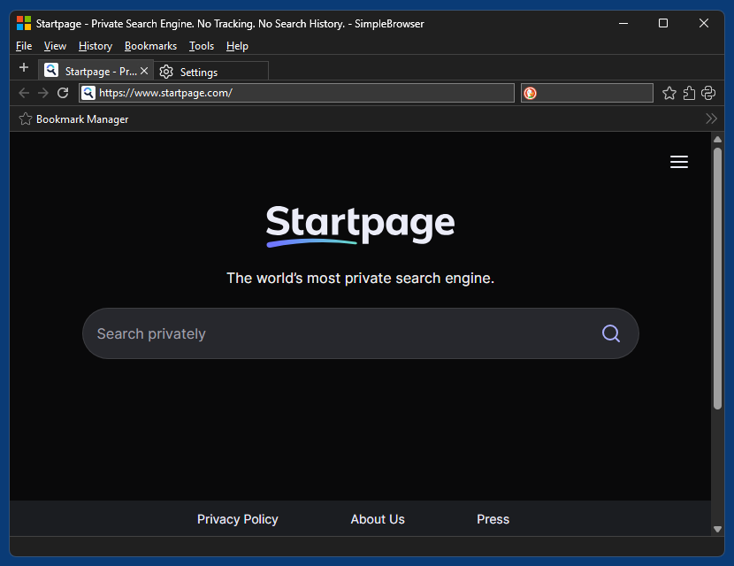

# SimpleBrowser (beta)

SimpleBrowser is a simple and small multi-tab desktop browser for Windows 11, based on Python, [Microsoft Edge WebView2](https://developer.microsoft.com/en-us/microsoft-edge/webview2) and native WinAPI controls. It's a showcase app for WebView2 Python binding [WebView2-for-Python](https://github.com/59de44955ebd/webview2-for-python).

*SimpleBrowser running in Windows 11 (dark mode)*

## Features:

* Multi-tab, either horizontal or vertical tabs
* Dark mode support
* (Limited) extension support - extensions can be installed both from the [Edge](https://microsoftedge.microsoft.com/addons/microsoft-edge-extensions) and the [Chrome](https://chromewebstore.google.com/category/extensions) extension store, or from a local folder or .crx file. For demonstration purposes the browser comes with 5 extensions preinstalled, but of course you are free to uninstall them (menu "Tools" --> "Extensions").
* Python addons - the browser can be extended with small Pythons scripts.
* Bookmark import from common browsers
* Can use a local/private Runtime version (download a "FixedVersionRuntime" .cab, unpack it e.g. with 7-Zip, rename the unpacked directory "runtime" and put it into the "data" directory next to SimpleBrowser.exe). 

## Known issues

* "Show all History" under menu "History", resp. URL "edge://history/all", immediately crashes the current tab when you use WebView2 Runtime versions 148.x - 151.x. This is a [known bug](https://github.com/MicrosoftEdge/WebView2Feedback/issues/5604) of WebView2 itself, and will be fixed in the next Runtime release version 152. For now, either use runtime 147.x, manually [patch](https://github.com/MicrosoftEdge/WebView2Feedback/issues/5604#issuecomment-5151323064) the latest Runtime 151.x or abstain from loading that history URL.

* Bookmarks imported from other browsers or an exported bookmark HTML file have no decent icons until you navigate to the bookmark's URL. There is unfortunately no WebView2 API available for manually adding favicons for URLs that havn't been visited yet.
